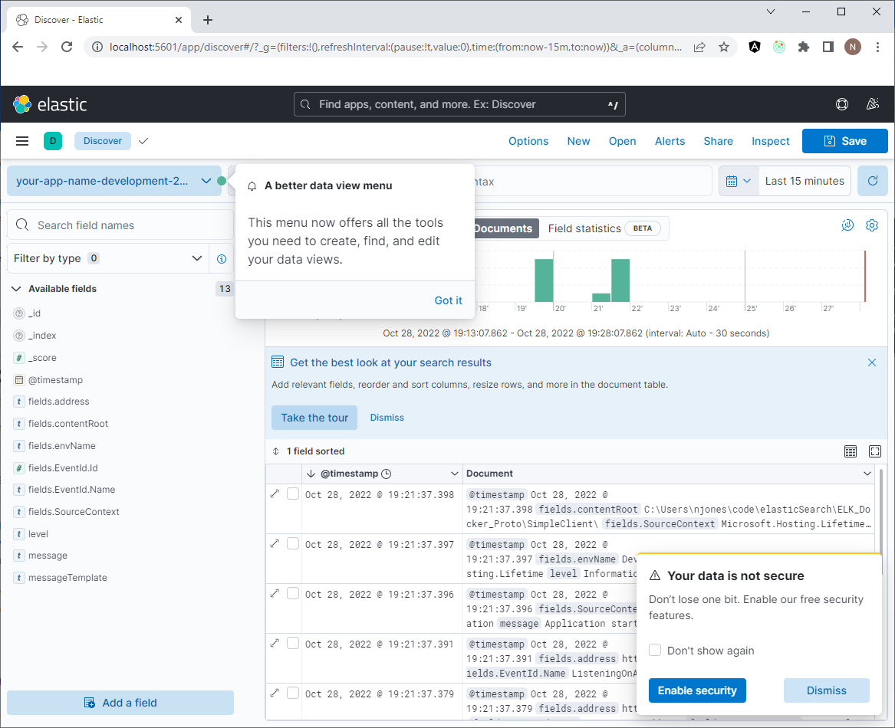

# ELK Docker Proto
https://medium.com/@karimifard.milad/how-to-integrate-serilog-with-elasticsearch-8-b1e2ce656a28

You may need to run:

`dotnet dev-certs https --trust`

in Powershell opened with Admin privileges for browser.

